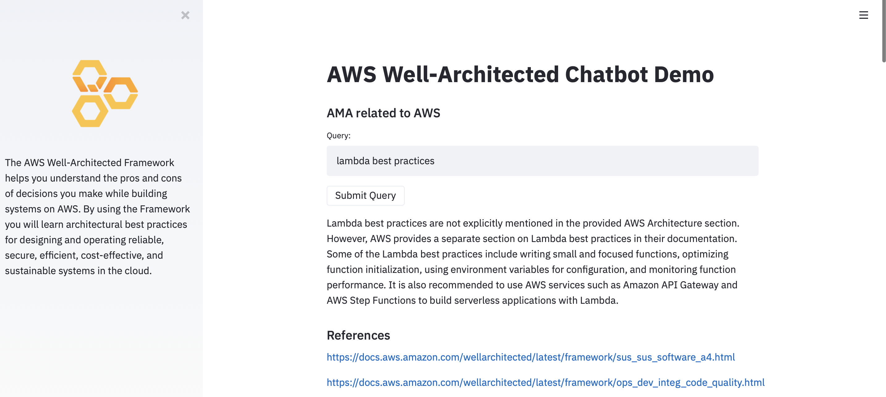

# AWS Architecture Bot
## AWS Documentation Scraper
Script: aws-scraper.py

### Script Details
- Go through given AWS Documentation and all its sub-pages
- create a data-file in csv format with num_tokens and embeddings for each section

### Run
- ```pip install -r requirements.txt```
- ```./aws-scraper.py```

### Output
- data.csv

## AWS Architecture Chatbot
Script: aws-arch-bot.py

### Pre-requisites
- pre-processed input file (AWS architecture sections) with embeddings

### Script Details
- takes a query
- scans given content, from AWS Architecture sections
- provides an answer based on the query and content

### Run
- ```pip install -r requirements.txt```
- Edit 'query' in the script
- ```./aws-arch-bot.py```

## AWS Architecture Chatbot as Streamlit App
Script: aws-arch-bot-st.py

### Pre-requisites
- pre-processed input file (AWS architecture sections) with embeddings

### Script Details
- takes a query in streamlit app UI
- scans given content, from AWS Architecture sections
- provides an answer based on the query and content
- print reference URLs from AWS documentation

### Run
- ```pip install -r requirements.txt```
- ```streamlit run aws-arch-bot-st.py```
- This should automatically open the streamlit application in your local machine' browser

### Sample



## Pre-requisites
- This has been tested with Python 3.9 (mac) and 3.10 (raspberry-pi). It should work with >=3.8
- Create a file localsecrets.py with your openai api-key in the format
```openaikey="sk-xxxx"```
- rustc (In Linux, install latest version with ```curl https://sh.rustup.rs -sSf | sh```)
- gfortran (Debian: ```sudo apt-get install gfortran```)
- lzma (Debian: ```sudo apt-get install liblzma-dev```)
- openblas (Debian: ```sudo apt-get install libopenblas-dev```)

## References
- https://github.com/openai/openai-cookbook/blob/d67c4181abe9dfd871d382930bb778b7014edc66/examples/Obtain_dataset.ipynb
- https://github.com/openai/openai-cookbook/blob/main/examples/Question_answering_using_embeddings.ipynb
- https://www.buildon.aws/posts/well-arch-chatbot
